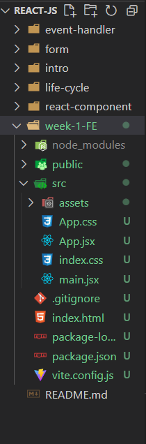

# Writing FE-Bootcamp Week 1

## Introduction to React
React adalah JavaScript library yang digunakan untuk membangun User Interface (antarmuka pengguna). Hal ini ditegaskan oleh tim pengembang React pada website resminya di reactjs.org. 
React diciptakan oleh Meta (dahulu Facebook) dan mulai dipublikasi pada NPM repository sejak tahun 2012.

## Install React
- Sebelum menginstall React kita disarankan terlebih dahulu untuk menginstall node js untuk dapat mengguanakan npm
- Ada 2 cara penginstallan react :
  - Kalian bisa menginstall react menggunakan ``npm create-react-app`` pada terminal kalian
  - Atau kalian bisa menggunakan vite js dengan menggunakan ``npm create vite@latest [nama-project] --template react``
  - Untuk menjalankan react kalian bisa menggunakan ``npm run dev`` ataupun ``npm start``
  
## Struktur Folder React
Untuk struktur folder pada react kita cukup fokus pada folder src saja
- 

## React.js Basic 

### Functional Component

Functional component adalah sebuah komponen yang dibuat menggunakan function baik menggunakan function declaration, function expression maupun arrow function. Pada functional component menjalankan proses rendering menggunakan return statement yang mengembalikan sebuah JSX. pada functional component dapat menerima props sebagai parameter yang kemudian dapat digunakan pada JSX yang di return.

- contoh functional component

  ```javascript
  import React from "react";

  const App = () => {
    return (
      <div>
        <h1>Hai Tegar Rys</h1>
      </div>
    );
  };

  export default App;
  ```

### Props

Props adalah sebuah object yang berisi data yang akan digunakan pada komponen. Props dapat diterima oleh komponen sebagai parameter. Props dapat diterima oleh functional component maupun class component. Props dapat digunakan pada JSX yang di return oleh functional component maupun class component. Props dapat digunakan untuk mengirimkan data dari parent component ke child component. props dapat ditulis meggunakan decturcturing object.

- contoh props

  ```javascript
  import React from "react";

  const App = (props) => {
    return (
      <div>
        <h1>Hello, {props.name}</h1>
      </div>
    );
  };

  export default App;
  ```

  ```javascript
  import React from "react";
  import App from "./App";

  const App = () => {
    return (
      <div>
        <App name="Tegar Rys" />
      </div>
    );
  };
  ```

- contoh props menggunakan decturcturing object

  ```javascript
  import React from "react";

  const App = ({ name }) => {
    return (
      <div>
        <h1>Hello, {name}</h1>
      </div>
    );
  };

  export default App;
  ```

  ```javascript
  import React from "react";
  import App from "./App";

  const App = () => {
    return (
      <div>
        <App name="Tegar Rys" />
      </div>
    );
  };
  ```

### State

State adalah sebuah object yang berisi data yang akan digunakan pada komponen. State dapat diterima oleh komponen sebagai parameter. State dapat diterima oleh class component. State dapat digunakan pada JSX yang di return oleh class component. State dapat digunakan untuk mengirimkan data dari parent component ke child component. State dapat ditulis meggunakan decturcturing object. State juga dapat digunakan pada functional component menggunakan hooks. State dapat digunakan untuk mengubah data pada komponen.

- contoh state

  ```javascript
  import React, { Component } from "react";

  class App extends Component {
    state = {
      name: "Tegar Rys",
    };

    render() {
      return (
        <div>
          <h1>Hai, {this.state.name}</h1>
        </div>
      );
    }
  }

  export default App;
  ```

- menggunakan decturcturing object

  ```javascript
  import React, { Component } from "react";

  class App extends Component {
    state = {
      name: "Tegar Rys",
    };

    render() {
      const { name } = this.state;
      return (
        <div>
          <h1>Hi, {name}</h1>
        </div>
      );
    }
  }

  export default App;
  ```

- menggunakan hooks

  ```javascript
  import React, { useState } from "react";

  const App = () => {
    const [name, setName] = useState("Tegar Rys");

    return (
      <div>
        <h1>Hi, {name}</h1>
      </div>
    );
  };

  export default App;
  ```

### Styling

Styling dapat dilakukan dengan menggunakan CSS, CSS Module, CSS in JS, dan Styled Component. Styling pada React.js dapat dilakukan dengan menggunakan inline styling, external styling, dan internal styling. Styling pada React.js dapat dilakukan dengan menggunakan class styling dan id styling. Styling pada React.js dapat dilakukan dengan menggunakan camelCase styling dan kebab-case styling. dan pemberian class styling pada React.js dapat dilakukan dengan menggunakan className.

- contoh styling pada React.js

  ```javascript
  import React from "react";

  const App = () => {
    return (
      <div>
        <h1 style={{ color: "blue" }}>Hi, Tegar Rys</h1>
      </div>
    );
  };

  export default App;
  ```

  ```javascript
  import React from "react";
  import "./App.css";

  const App = () => {
    return (
      <div>
        <h1 className="text-blue">Hi, Tegar Rys</h1>
      </div>
    );
  };

  export default App;
  ```

### Handling Event 

Handling event dapat dilakukan dengan menggunakan event listener. Handling event pada React.js dapat dilakukan dengan menggunakan event listener pada JSX. Handling event pada React.js dapat dilakukan dengan menggunakan event listener pada class component dan functional component menggunakan hooks. jenis event pada react js adalah onClick, onChange, onSubmit, onKeyPress dan lain-lain.

- contoh handling event pada React.js

  ```javascript
  import React from "react";

  const App = () => {
    const handleClick = () => {
      console.log("Hi, Tegar Rys");
    };

    return (
      <div>
        <button onClick={handleClick}>Click Me</button>
      </div>
    );
  };

  export default App;
  ```

  ```javascript
  import React, { Component } from "react";

  class App extends Component {
    handleClick = () => {
      console.log("Hi, Tegar Rys");
    };

    render() {
      return (
        <div>
          <button onClick={this.handleClick}>Click Me</button>
        </div>
      );
    }
  }

  export default App;
  ```

- contoh handling event pada React.js menggunakan hooks

  ```javascript
  import React, { useState } from "react";

  const App = () => {
    const [name, setName] = useState("Tegar Rys");

    return (
      <div>
        <button onClick={() => setName("Kukuh Ys")}>Click Me</button>
      </div>
    );
  };
  ```

### Conditional Rendering 

- contoh conditional rendering pada ReactJs menggunakan if else

  ```javascript
  import React from "react";

  const App = () => {
    const name = "Tegar Rys";

    if (name === "Tegar Rys") {
      return <h1>Hii, Tegar Rys</h1>;
    } else {
      return <h1>Hi, Guest</h1>;
    }
  };

  export default App;
  ```

### Life Cycle

Life cycle method adalah method yang akan dijalankan pada saat tertentu. Life cycle method pada React.js adalah method yang akan dijalankan pada saat mounting, updating, dan unmounting. Life cycle method pada React.js adalah method yang akan dijalankan pada saat mounting yaitu constructor, getDerivedStateFromProps, render, componentDidMount, dan getSnapshotBeforeUpdate. Life cycle method pada React.js adalah method yang akan dijalankan pada saat updating yaitu getDerivedStateFromProps, shouldComponentUpdate, render, getSnapshotBeforeUpdate, dan componentDidUpdate. Life cycle method pada React.js adalah method yang akan dijalankan pada saat unmounting yaitu componentWillUnmount.

- contoh life cycle method

  ```javascript
  import React, { Component } from "react";

  class App extends Component {
    constructor(props) {
      super(props);
      console.log("constructor");
    }

    componentDidMount() {
      console.log("componentDidMount");
    }

    componentDidUpdate() {
      console.log("componentDidUpdate");
    }

    componentWillUnmount() {
      console.log("componentWillUnmount");
    }

    render() {
      console.log("render");
      return <h1>Hi, Tegar Rys</h1>;
    }
  }

  export default App;
  ```

### Hooks 

Hooks pada React.js adalah function yang dapat digunakan pada functional component. Hooks pada React.js adalah function yang dapat digunakan pada functional component untuk menggantikan class component. Hooks pada React.js adalah function yang dapat digunakan pada functional component untuk menggantikan class component yaitu useState, useEffect, useContext, useReducer, useCallback dan masih banyak lagi.

- contoh hooks useEffect pada React.js

  ```javascript
  import React, { useState, useEffect } from "react";

  const App = () => {
    const [name, setName] = useState("Tegar Rys");

    useEffect(() => {
      console.log("Hi, Tegar Rys");
    }, []);

    return (
      <div>
        <h1>Hello, {name}</h1>
      </div>
    );
  };

  export default App;
  ```

- contoh hooks useState pada React.js

  ```javascript
  import React, { useState } from "react";

  const App = () => {
    const [name, setName] = useState("Tegar Rys");

    return (
      <div>
        <h1>Hello, {name}</h1>
      </div>
    );
  };

  export default App;
  ```

### Forms 

Forms adalah form yang dapat digunakan untuk mengambil input dari user. Forms pada React.js adalah form yang dapat digunakan untuk mengambil input dari user menggunakan hooks. Forms pada React.js adalah form yang dapat digunakan untuk mengambil input dari user menggunakan hooks yaitu useState, useRef, dan useEffect.

- contoh forms method post menggunakan axios

  ```javascript
  
  import React, { useState } from "react";
  import axios from "axios";

  const App = () => {
    const [name, setName] = useState("");
    const [email, setEmail] = useState("");
    const [password, setPassword] = useState("");

    const handleSubmit = (e) => {
      e.preventDefault();

      const data = {
        name,
        email,
        password,
      };

      axios
        .post("https://reqres.in/api/users", data)
        .then((res) => {
          console.log(res);
        })
        .catch((err) => {
          console.log(err);
        });
    };

    return (
      <div>
        <form onSubmit={handleSubmit}>
          <input
            type="text"
            placeholder="Name"
            value={name}
            onChange={(e) => setName(e.target.value)}
          />
          <input
            type="email"
            placeholder="Email"
            value={email}
            onChange={(e) => setEmail(e.target.value)}
          />
          <input
            type="password"
            placeholder="Password"
            value={password}
            onChange={(e) => setPassword(e.target.value)}
          />
          <button type="submit">Submit</button>
        </form>
      </div>
    );
  };

  export default App;
  ```
